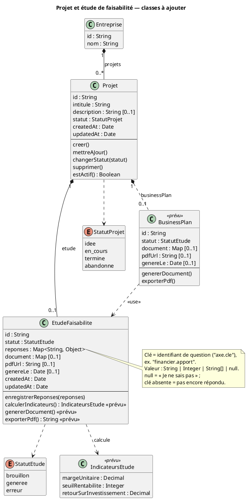
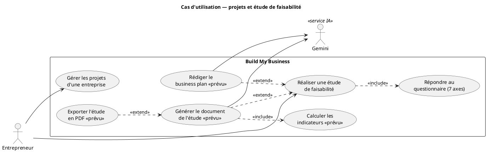

# Classes « Projet » et « Étude de faisabilité » — fiche PowerAMC

Fiche prête à recopier dans le diagramme de classes (PowerAMC). Tout ce qui
est marqué **existe** est vérifiable dans le code ; ce qui est marqué
**prévu** n'est pas encore implémenté et doit apparaître en pointillé ou avec
le stéréotype `<<prévu>>`.

Sources : `supabase/migrations/20261001090000_projet.sql`,
`supabase/migrations/20261002100000_etude_faisabilite.sql`,
`src/data/projet.ts`, `src/data/etudeFaisabilite.ts`,
`src/lib/questionsEtude.ts`, `src/data/entreprise.ts`.

Convention de types UML : `String`, `Integer`, `Boolean`, `Date` (colonne
`timestamptz` ; PowerAMC accepte aussi `DateTime`), `Map` (colonne `jsonb`).
Les `uuid` sont des `String`.

---

## 1. Nouvelles classes

### 1.1 Projet — **existe** (table `projet`)

| Attribut | Type UML | Description |
|---|---|---|
| id | String | Identifiant (uuid, clé primaire). |
| intitule | String | Titre du projet (ex. « Ouverture d'un second point de vente »). Obligatoire. |
| description | String [0..1] | Description libre, facultative. |
| statut | StatutProjet | Cycle de vie ; `idee` par défaut. |
| createdAt | Date | Date de création. |
| updatedAt | Date | Date de dernière modification. |

`entreprise_id` n'est pas un attribut : c'est l'association avec `Entreprise`
(voir § 3).

| Opération | Statut | Correspondance dans le code |
|---|---|---|
| creer(intitule, description) : Projet | existe | `creerProjet()` dans `src/data/projet.ts` |
| mettreAJour(champs) | existe | `mettreAJourProjet()` (intitulé, description, statut) |
| changerStatut(statut : StatutProjet) | existe | cas particulier de `mettreAJourProjet()` |
| supprimer() | existe | `supprimerProjet()` (l'étude est supprimée en cascade) |
| estActif() : Boolean | existe | vrai si statut ∈ {idee, en_cours} (`STATUTS_ACTIFS`, `compterProjetsActifs()`) |

### 1.2 EtudeFaisabilite — **existe** (table `etude_faisabilite`)

| Attribut | Type UML | Description |
|---|---|---|
| id | String | Identifiant (uuid). |
| statut | StatutEtude | `brouillon` par défaut ; `generee` ou `erreur` après génération. |
| reponses | Map<String, Object> | Réponses au questionnaire, indexées par identifiant de question (`"financier.apport"`…). `null` = « Je ne sais pas » ; clé absente = pas encore répondu. Voir § 4. |
| document | Map [0..1] | Étude rédigée par l'IA (colonne présente, non alimentée pour l'instant). |
| pdfUrl | String [0..1] | URL du PDF exporté (colonne présente, non alimentée). |
| genereLe | Date [0..1] | Date de la dernière génération réussie. |
| createdAt | Date | Date de création. |
| updatedAt | Date | Date de dernière sauvegarde. |

`projet_id` (unique) n'est pas un attribut : c'est l'association avec `Projet`.

| Opération | Statut | Correspondance / rôle |
|---|---|---|
| enregistrerReponses(reponses) | existe | `enregistrerReponses()` dans `src/data/etudeFaisabilite.ts` : upsert sur `projet_id`, les réponses remplacent les précédentes. |
| calculerIndicateurs() : IndicateursEtude | prévu | Calculs faits par le code (pas par l'IA) à partir de `reponses` : marge unitaire = `offre.prix_moyen − financier.cout_variable` ; seuil de rentabilité = `financier.charges_fixes ÷ marge unitaire` (ventes par mois) ; retour sur investissement à partir de `financier.cout_demarrage`. |
| genererDocument() | prévu | Appel à l'IA (Gemini) qui rédige l'étude dans `document` ; passe le statut à `generee` (ou `erreur`) et renseigne `genereLe`. |
| exporterPdf() : String | prévu | Produit le PDF de `document`, renseigne `pdfUrl`. |

Remarque : si vous souhaitez montrer les indicateurs calculés, ajoutez une
petite classe `IndicateursEtude {margeUnitaire : Decimal ; seuilRentabilite :
Integer ; retourSurInvestissement : Decimal}` en `<<prévu>>`, reliée par une
dépendance (flèche pointillée) depuis `EtudeFaisabilite`. Elle n'est **pas**
persistée (aucune table) : c'est un résultat de calcul.

### 1.3 BusinessPlan — **prévu** (aucune table, aucun code)

À dessiner en pointillé avec le stéréotype `<<prévu>>`.

| Attribut | Type UML | Description |
|---|---|---|
| id | String | Identifiant. |
| statut | StatutEtude | Même cycle que l'étude (brouillon / généré / erreur). |
| document | Map [0..1] | Business plan rédigé par l'IA. |
| pdfUrl | String [0..1] | Export PDF. |
| genereLe | Date [0..1] | Dernière génération. |

Opérations : `genererDocument()`, `exporterPdf()` (prévues). Le business plan
**s'appuie sur l'étude de faisabilité** : dépendance `BusinessPlan ..>
EtudeFaisabilite <<use>>` et association `Projet 1 — 0..1 BusinessPlan`.

---

## 2. Énumérations à créer

| Énumération | Valeurs (code) | Libellé affiché | Source |
|---|---|---|---|
| StatutProjet | idee, en_cours, termine, abandonne | Idée, En cours, Terminé, Abandonné | `STATUTS_PROJET` (`src/data/projet.ts`), contrainte `check` de `projet` |
| StatutEtude | brouillon, generee, erreur | Brouillon, Générée, Erreur de génération | `STATUTS` (`src/data/etudeFaisabilite.ts`), contrainte `check` de `etude_faisabilite` |
| TypeQuestion | texte, texte_court, nombre, montant, choix, choix_multiple | — | `TypeQuestion` dans `questionsEtude.ts` (utile seulement si vous dessinez le catalogue de questions, voir § 5) |

Les listes d'options de certaines questions peuvent aussi être dessinées en
énumérations si vous voulez typer les réponses correspondantes (facultatif,
toutes dans `questionsEtude.ts`) :

| Énumération | Valeurs | Question |
|---|---|---|
| ModeleRevenus | vente_directe, abonnement, commission, location, autre | `offre.modele_revenus` |
| NiveauCompetences | oui, partiel, recruter | `technique.competences` |
| CanalVente | sur_place, livraison, en_ligne, reseaux_sociaux, revendeurs | `operations.canaux` (choix multiple) |
| SourceFinancement | epargne, famille, pret, investisseur, aucun_besoin | `financier.source_financement` |
| DelaiLancement | moins_3_mois, 3_6_mois, plus_6_mois | `risques.delai_lancement` |

Recommandation : dans le diagramme du mémoire, ne créer que `StatutProjet` et
`StatutEtude` (seules énumérations contraintes en base). Les cinq autres
alourdissent le diagramme sans apporter de structure ; les mentionner dans le
texte suffit.

---

## 3. Associations

| Association | Multiplicités | Type | Justification |
|---|---|---|---|
| Entreprise — Projet | 1 — 0..* | Composition (losange plein côté Entreprise) | `entreprise_id … on delete cascade` : un projet n'existe pas sans son entreprise et disparaît avec elle. |
| Projet — EtudeFaisabilite | 1 — 0..1 | Composition (losange plein côté Projet) | `projet_id unique … on delete cascade` : une seule étude par projet, supprimée avec lui. |
| Projet — BusinessPlan `<<prévu>>` | 1 — 0..1 | Composition, en pointillé | Même logique que l'étude (à confirmer lors de l'implémentation). |
| BusinessPlan ..> EtudeFaisabilite `<<use>>` | — | Dépendance | Le business plan est rédigé à partir de l'étude. |
| EtudeFaisabilite ..> IndicateursEtude `<<prévu>>` | — | Dépendance | Résultat de `calculerIndicateurs()`, non persisté. |

Rôles conseillés : `projets` côté Entreprise, `etude` côté Projet.

Rappel des associations existantes à garder cohérentes : Compte 1 — 0..*
Entreprise ; Entreprise 1 — 0..1 IdentiteVisuelle ; Entreprise 1 — 0..* Site
(un par modèle, couple `entreprise_id` + `template_id` dans `src/data/site.ts`).

---

## 4. Représenter le JSON `reponses` en UML

Deux options correctes :

**Option A — attribut `reponses : Map<String, Object>`** sur
`EtudeFaisabilite`, avec une note UML : « clé = identifiant de question
(`axe.cle`), valeur = String | Integer | String[] | null ; null = “Je ne sais
pas” ». C'est la traduction fidèle de la colonne `jsonb` et du type
`ReponsesEtude = Record<string, string | number | string[] | null>`
(`questionsEtude.ts`).

**Option B — classe `ReponseEtude {questionId : String ; valeur : String
[0..1]}`** en composition `EtudeFaisabilite 1 — 0..* ReponseEtude`. Plus
« orientée objet », mais elle suggère une table `reponse_etude` qui n'existe
pas.

**Recommandation pour le mémoire : option A**, pour trois raisons :
1. elle reflète la structure réelle (une colonne `jsonb`, pas de table de
   réponses) ; le jury peut la vérifier dans la migration ;
2. elle évite d'inventer 16 attributs ou une classe fantôme ;
3. une note attachée à l'attribut suffit à expliquer la convention
   `null` = « Je ne sais pas » et l'évolution possible (ajouter une question
   = ajouter une clé, sans migration).

Si l'enseignant exige un modèle « sans Map », retenir l'option B et préciser
dans le texte qu'elle est **réalisée** par une colonne JSON (choix
d'implémentation, pas une table).

---

## 5. Ce qui ne doit PAS apparaître comme classe

- **Les 7 axes** (`projet`, `marche`, `offre`, `technique`, `operations`,
  `financier`, `risques`) : ce sont les écrans du formulaire, décrits par la
  constante `AXES_ETUDE` dans `src/lib/questionsEtude.ts`. Aucune table, aucune
  instance persistée.
- **Les 16 questions** : catalogue statique (`id`, `libelle`, `type`,
  `options`) dans le même fichier. Même statut que les modèles de site
  (`template_id` de `Site`, dossiers `public/Templates/`) : une donnée de
  configuration, pas une entité métier.
- **Les options de réponse** (vente directe, abonnement…) : énumérations au
  plus (§ 2), jamais des classes.
- L'axe où reprendre le questionnaire n'est pas un attribut : il se déduit des
  réponses (premier axe sans aucune clé), car il décrit la saisie en cours,
  pas l'étude elle-même.

Si l'on tient à montrer le questionnaire, le faire dans un **diagramme à
part** (ou une note) : `AxeEtude {id, titre, intro} 1 — 1..* Question {id,
libelle, aide, type : TypeQuestion} 1 — 0..* OptionQuestion {value, label}`,
avec le stéréotype `<<catalogue statique>>`, exactement comme on traiterait
`ModeleSite`. Ne pas le relier par association à `EtudeFaisabilite` (le lien
est la clé de `reponses`, pas une clé étrangère).

---

## 6. Diagramme de classes (PlantUML)

Lecture : une entreprise compose plusieurs projets ; chaque projet compose au
plus une étude de faisabilité (et, plus tard, un business plan qui s'appuiera
sur l'étude). Les éléments `<<prévu>>` sont à dessiner en pointillé dans
PowerAMC.

---

## 7. Cas d'utilisation à ajouter au diagramme global

Acteur : **Entrepreneur** (connecté ; la connexion est une précondition, pas
un `<<include>>`). Acteur secondaire : **Gemini** (service IA) pour la
génération.

| Cas d'utilisation | Statut | Relations |
|---|---|---|
| Gérer les projets d'une entreprise | existe | Regroupe : Créer un projet, Modifier un projet, Changer le statut d'un projet, Supprimer un projet |
| Réaliser une étude de faisabilité | existe (questionnaire) | `<<include>>` Répondre au questionnaire (7 axes, sauvegarde à chaque étape, reprise au premier axe sans réponse) |
| Générer le document de l'étude | prévu | `<<extend>>` Réaliser une étude de faisabilité (point d'extension : « réponses enregistrées ») ; communique avec Gemini ; `<<include>>` Calculer les indicateurs (marge, seuil de rentabilité, ROI — calcul par le code) |
| Exporter l'étude en PDF | prévu | `<<extend>>` Générer le document de l'étude (point d'extension : « document généré ») |
| Rédiger le business plan | prévu | `<<extend>>` Réaliser une étude de faisabilité ; dépend du document de l'étude ; communique avec Gemini |

Lecture : aujourd'hui, l'entrepreneur gère ses projets et répond au
questionnaire de l'étude ; la génération du document par l'IA, le calcul des
indicateurs, l'export PDF et le business plan sont des extensions prévues.
