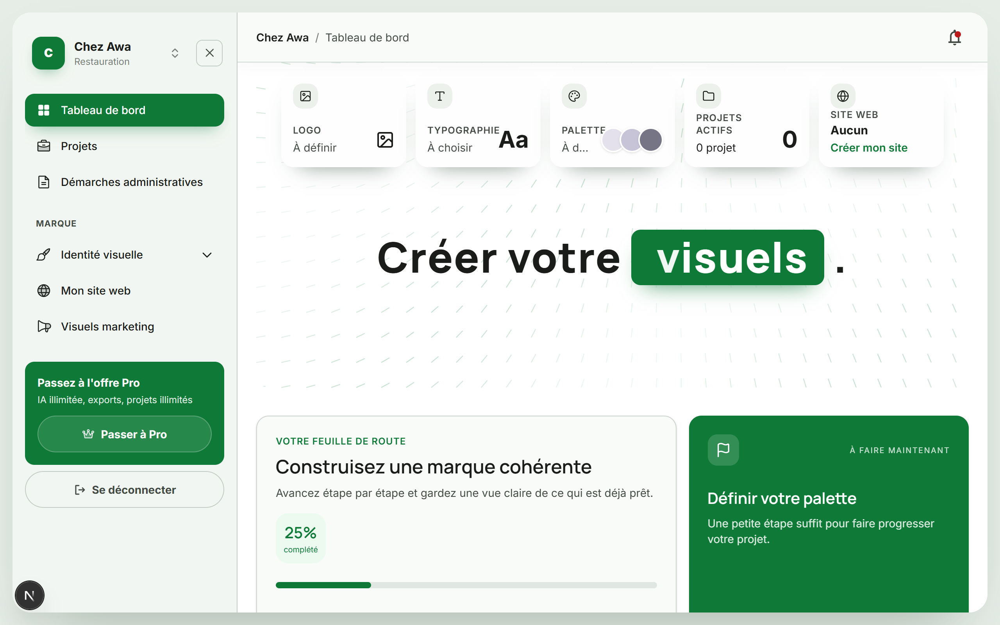
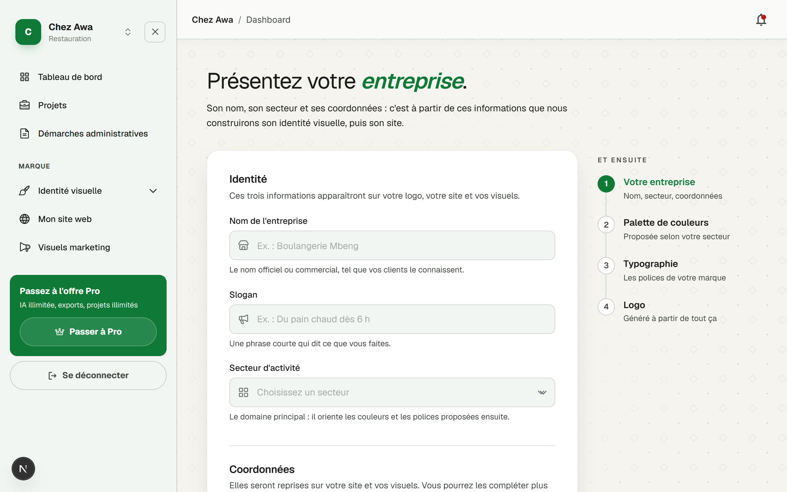
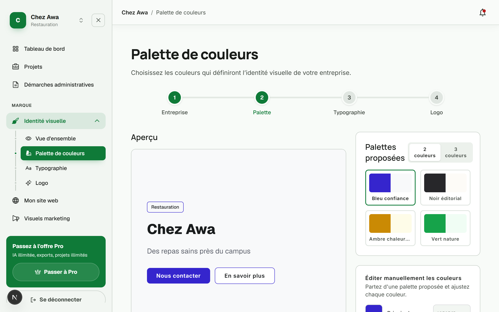
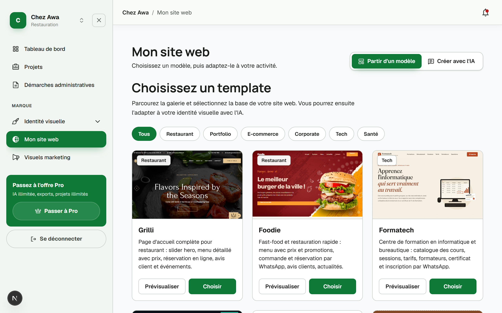

# II. GUIDE D'UTILISATION

Ce guide présente les quatre fonctionnalités principales de Build My Business, dans l'ordre où un entrepreneur les rencontre. Les captures ont été réalisées avec un compte de test et l'entreprise fictive « Chez Awa », un restaurant.

## 1. Le tableau de bord

Après connexion, l'entrepreneur arrive sur son tableau de bord. La barre latérale donne accès à toutes les sections : projets, démarches administratives, identité visuelle, site web, visuels marketing. En haut, cinq cartes résument l'état de la marque : logo, typographie, palette, projets actifs et site web, chacune indiquant ce qui reste à faire. La feuille de route affiche la progression globale et la carte « À faire maintenant » propose l'étape suivante la plus utile. Le sélecteur en haut à gauche permet de passer d'une entreprise à une autre lorsque le compte en possède plusieurs.

Figure 1 : tableau de bord de l'entrepreneur

## 2. La création d'une entreprise

Depuis le tableau de bord, l'entrepreneur renseigne les informations de son entreprise : nom, slogan, secteur d'activité, téléphone et adresse. Chaque champ est accompagné d'une aide expliquant où l'information sera réutilisée. La colonne de droite indique la suite du parcours : palette de couleurs, typographie, logo. À l'enregistrement, l'entreprise devient l'entreprise active et toutes les fonctions suivantes s'appuient sur ses informations sans qu'il faille les ressaisir.

Figure 2 : formulaire de création d'une entreprise

## 3. L'identité visuelle : la palette de couleurs

Première étape de l'identité visuelle, la palette de couleurs. L'entrepreneur choisit parmi des palettes proposées, en deux ou trois couleurs, ou ajuste manuellement chaque couleur grâce aux sélecteurs. L'aperçu de gauche montre immédiatement le résultat appliqué à sa propre entreprise : nom, slogan, secteur et boutons. Le bouton « Continuer » enregistre le choix et conduit à l'étape suivante, la typographie, puis au logo. Ces choix seront repris automatiquement dans le site web et les visuels marketing.

Figure 3 : choix et édition de la palette de couleurs

## 4. Le site web

La section « Mon site web » propose deux manières de créer un site. « Partir d'un modèle » affiche une galerie de modèles classés par secteur (restaurant, technologie, formation, commerce), chacun avec un aperçu réel et un bouton « Prévisualiser ». Au clic sur « Choisir », le modèle est rempli automatiquement avec le nom, les coordonnées et l'identité visuelle de l'entreprise, puis il peut être modifié par de simples instructions en français adressées à l'IA. « Créer avec l'IA » permet au contraire de décrire son site en quelques phrases et de le laisser générer entièrement. Dans les deux cas, le bouton « Publier » met le site en ligne à une adresse publique que l'entrepreneur peut partager.

Figure 4 : galerie des modèles de sites web
