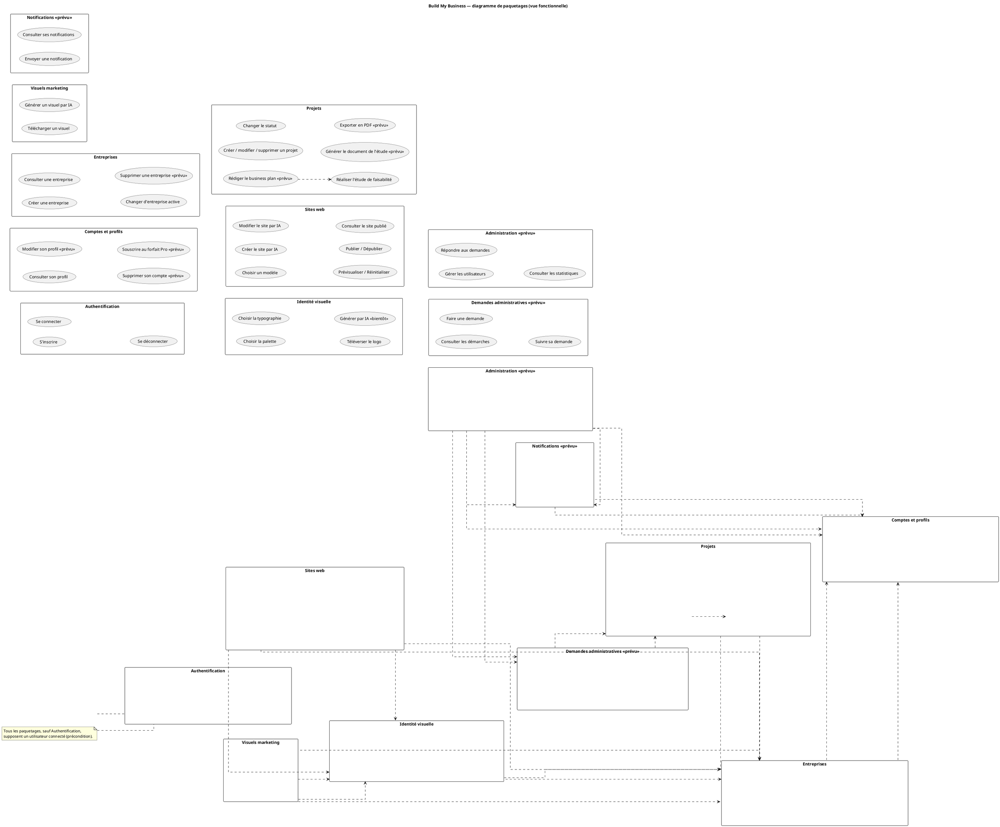
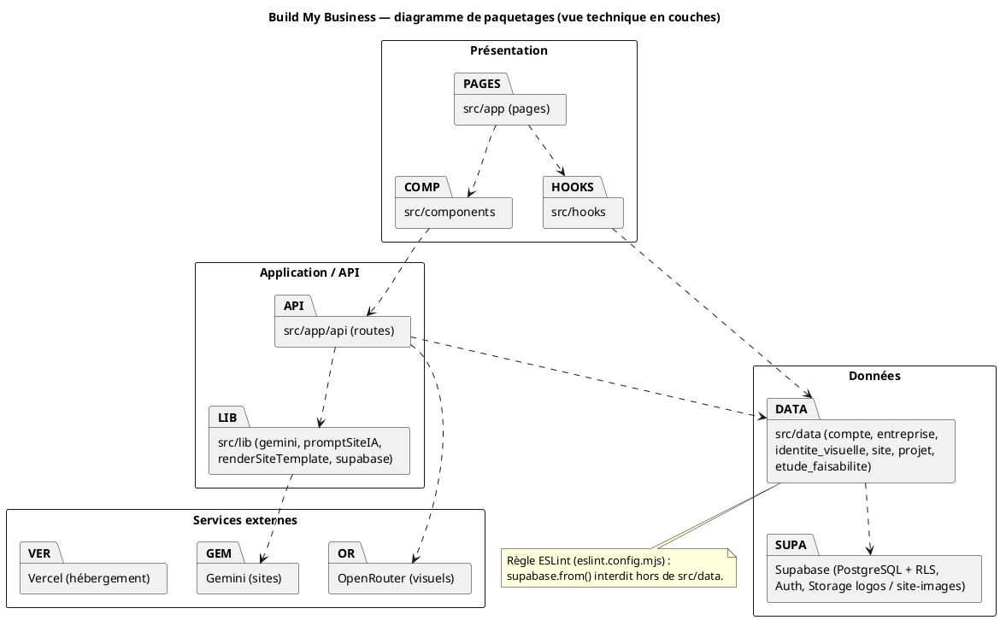

# Revue du diagramme de paquetages (PowerAMC)

Diagramme examiné : paquetage central « S'authentifier » entouré de 12
paquetages fonctionnels (« Gérer Entreprise », « Gérer Site web », « gérer
identité », « gérer demande », « Générer branding », « Consulter demande
administrative », « Gérer Profil », « Gérer notifications »,
« Gérer_Utilisateurs », « Gérer visuel », « consulter statistique », « Gérer
projet »), chacun relié à des petits paquetages feuilles (« créer entreprise »,
« publier site web », « créer logo », « Se déconnecter »…) par des flèches
`<<include>>` / `<<extend>>`.

Sources vérifiées : `src/app` (écrans), `src/app/api` (routes), `src/data`
(tables), `src/components`, `src/lib`, `src/components/dashboard/nav-items.ts`,
`docs/rapport/classes-projet-etude.md`.

---

## 1. Le problème de fond

- **Ce n'est pas un diagramme de paquetages, c'est un diagramme de cas
  d'utilisation redessiné avec des icônes de paquetage.** Chaque boîte (« créer
  entreprise », « publier site web », « Se déconnecter ») est un cas
  d'utilisation, pas un regroupement.
- **`<<include>>` et `<<extend>>` n'existent pas entre paquetages.** Ce sont des
  relations réservées aux cas d'utilisation (UML 2.5, § 18.1). Entre paquetages,
  les seules relations sont :
  - `<<import>>` : le paquetage rend visibles (publiquement) les éléments d'un
    autre ;
  - `<<access>>` : même chose, mais en visibilité privée ;
  - `<<merge>>` : fusion de définitions (rare, surtout dans les métamodèles) ;
  - la **dépendance simple** (flèche pointillée sans stéréotype, ou
    `<<use>>`) : « A a besoin de B pour fonctionner ». C'est celle qu'on utilise
    dans 95 % des rapports.
- **Un paquetage « S'authentifier » au centre n'a pas de sens.** S'authentifier
  est un cas d'utilisation (ou, techniquement, un module « Authentification »).
  Dessiner 12 flèches `<<include>>` vers lui répète l'erreur déjà signalée sur le
  diagramme de cas d'utilisation : la connexion est une **précondition** des
  autres cas, pas quelque chose que chacun « inclut ».
- **Un paquetage ne contient qu'une seule chose ici.** Un paquetage à un seul
  élément (« Se déconnecter », « créer projet ») ne regroupe rien : il n'a pas
  lieu d'être.

**Ce qu'est un diagramme de paquetages.** C'est un diagramme de *structure* qui
découpe le système en groupes logiques nommés (modules), montre ce que chaque
groupe contient (classes, cas d'utilisation, autres paquetages) et surtout
**qui dépend de qui**. Dans un rapport, il sert à :
1. donner une vue d'ensemble du périmètre en une page (les grands modules) ;
2. justifier le découpage du code (un paquetage = un dossier, idéalement) ;
3. mettre en évidence les dépendances et vérifier qu'il n'y a pas de cycle
   (une couche « basse » ne doit jamais dépendre d'une couche « haute »).

---

## 2. Ce qu'il faut garder

La **découpe fonctionnelle est bonne** : les 12 blocs correspondent aux modules
réels ou prévus de la plateforme. Correspondance avec le code :

| Bloc du diagramme | Statut | Où dans le code |
|---|---|---|
| S'authentifier | existe | `src/app/(auth)/page.tsx`, `(auth)/Inscription/page.tsx`, `src/app/api/login`, `api/register`, `src/lib/supabase/{browser,server}.ts`, `src/data/compte.ts` ; déconnexion dans `src/components/dashboard/SidebarContent.tsx` (`supabase.auth.signOut()`) |
| Gérer Entreprise | existe (création, consultation, changement d'entreprise) | `src/app/BuildEntreprise/page.tsx`, `src/components/BuildEntreprise/`, `src/app/api/entreprise`, `src/data/entreprise.ts`, `src/components/dashboard/EntrepriseSwitcher.tsx`. **Pas de suppression** dans `src/data/entreprise.ts` : « supprimer entreprise » est prévu. |
| gérer identité / Générer branding | existe (palette, typographie, logo téléversé) ; génération par IA affichée « Bientôt » | `src/app/IdentiteVisuelle`, `PaletteColor`, `Typographie`, `Logo`, `src/components/Identite_visuel/`, `src/app/api/identite-visuelle`, `src/data/identiteVisuelle.ts` (bucket `logos`). Les zones « Générer avec l'IA » de `PaletteBuilder.tsx`, `police.tsx`, `LogoBuilder.tsx` sont désactivées avec `SoonBadge`. |
| Gérer Site web | existe (choisir un modèle, créer/modifier par IA, publier, dépublier, réinitialiser) | `src/app/Templates/page.tsx`, `src/components/Templates/`, `src/app/api/site`, `site/publier`, `site/depublier`, `generate-site`, `edit-site`, `reset-site`, `site-preview/[templateId]`, `src/data/site.ts`, `src/app/s/[slug]`, `src/proxy.ts`, `src/lib/gemini.ts`, `src/lib/promptSiteIA.ts` |
| Gérer visuel | existe (générer, télécharger) ; non persisté | `src/app/Visuels/page.tsx`, `src/components/Visuels/`, `src/app/api/generate-visual` (OpenRouter) |
| Gérer projet | existe (créer, modifier, changer de statut, supprimer) + étude de faisabilité (questionnaire) | `src/app/Projets/page.tsx`, `Projets/[id]/etude/page.tsx`, `src/components/Projets/`, `src/components/Etude/`, `src/data/projet.ts`, `src/data/etudeFaisabilite.ts`, `src/lib/questionsEtude.ts` |
| Consulter demande administrative (« Démarches administratives ») | prévu | entrée de menu sans lien dans `nav-items.ts` |
| gérer demande (entrepreneur → admin) | prévu | aucun code |
| Gérer Profil | partiel : le profil est créé à l'inscription (`creerCompte`, `src/data/compte.ts`) ; modification et suppression prévues | `src/data/compte.ts` |
| Gérer notifications | prévu | seulement un bouton inactif dans `src/components/dashboard/TopNav.tsx` |
| Gérer_Utilisateurs (admin) | prévu | aucun code, aucun rôle admin |
| consulter statistique (admin) | prévu | aucun code |

Absents du diagramme mais déjà actés pour le rapport : **Étude de
faisabilité** (existe), **Business plan** (prévu), **Forfait / offre Pro**
(prévu, cf. mémoire du diagramme de cas d'utilisation).

---

## 3. Le diagramme corrigé à dessiner

### Option A — vue fonctionnelle (un paquetage par module)

- Un paquetage par module ; les cas d'utilisation sont **listés à l'intérieur**
  (ellipses dans le paquetage), **pas en sous-paquetages**.
- Dépendances simples (flèche pointillée) **uniquement** là où un module utilise
  les données ou les services d'un autre.
- Authentification : **une seule note** (« Tous les modules supposent un
  utilisateur authentifié ») à la place de 12 flèches.
- Les modules prévus en pointillé ou stéréotype `<<prévu>>`.

### Option B — vue technique en couches (colle au code)

| Couche / paquetage | Contenu | Dossiers |
|---|---|---|
| Présentation | pages, composants, hooks | `src/app/**/page.tsx`, `src/components/`, `src/hooks/` |
| Application / API | routes serveur, utilitaires, prompts IA | `src/app/api/**/route.ts`, `src/lib/` |
| Données | accès aux tables, buckets | `src/data/` (`compte`, `entreprise`, `identite_visuelle`, `site`, `projet`, `etude_faisabilite`), Supabase (PostgreSQL, Auth, Storage `logos`, `site-images`) |
| Services externes | IA et hébergement | Gemini (`src/lib/gemini.ts`, `api/edit-site`), OpenRouter (`api/generate-visual`), Vercel |

Dépendances descendantes uniquement : Présentation → Application → Données ;
Application → Services externes. La règle ESLint `no-restricted-syntax` de
`eslint.config.mjs` interdit `supabase.from(...)` hors de `src/data`, ce qui
**impose** techniquement cette séparation : c'est un argument fort à citer.

### Recommandation : mettre les deux, à deux endroits différents

- **Option A dans le chapitre « Analyse des besoins »** : elle structure les
  cas d'utilisation (le diagramme global devient lisible : un sous-diagramme par
  paquetage) et montre le périmètre cible, y compris les modules prévus.
- **Option B dans le chapitre « Conception / architecture »** : elle est
  vérifiable dans le code et prépare le diagramme de composants et de
  déploiement.
- Si un seul doit être conservé : **l'option A**, car c'est elle qui remplace
  le diagramme actuel et qui répond à ce qu'un jury attend après le diagramme
  de cas d'utilisation. L'option B peut alors être fusionnée avec le diagramme
  de composants.

### Option A — liste exacte à recopier

| Paquetage | Cas d'utilisation contenus | Statut |
|---|---|---|
| Authentification | S'inscrire ; Se connecter ; Se déconnecter | existe |
| Comptes et profils | Consulter son profil ; Modifier son profil ; Supprimer son compte ; Souscrire au forfait Pro | profil créé à l'inscription (existe) ; le reste prévu |
| Entreprises | Créer une entreprise ; Consulter une entreprise ; Changer d'entreprise active ; Supprimer une entreprise | existe sauf suppression |
| Identité visuelle | Choisir la palette de couleurs ; Choisir la typographie ; Téléverser le logo ; Générer la palette / la typographie / le logo par IA | existe ; génération IA « Bientôt » |
| Sites web | Choisir un modèle ; Créer le site par conversation IA ; Modifier le site par IA ; Prévisualiser ; Réinitialiser ; Publier ; Dépublier ; Consulter le site publié (`/s/<slug>`) | existe |
| Visuels marketing | Générer un visuel par IA ; Télécharger un visuel | existe (non persisté) |
| Projets | Créer un projet ; Modifier un projet ; Changer le statut ; Supprimer un projet ; Réaliser l'étude de faisabilité (questionnaire) ; Générer le document de l'étude ; Exporter en PDF ; Rédiger le business plan | existe jusqu'au questionnaire ; génération, PDF et business plan prévus |
| Demandes administratives | Consulter les démarches administratives ; Faire une demande (à l'admin) ; Suivre sa demande | prévu |
| Notifications | Consulter ses notifications ; Envoyer une notification (admin) | prévu |
| Administration | Gérer les utilisateurs (lister, désactiver, supprimer) ; Répondre aux demandes ; Consulter les statistiques | prévu |

Dépendances (flèche pointillée, lire « utilise ») :

| De | Vers | Pourquoi (preuve dans le code) |
|---|---|---|
| Sites web | Entreprises | un site appartient à une entreprise (`entreprise_id`, `src/data/site.ts`) |
| Sites web | Identité visuelle | le prompt du site reprend palette, police et logo (`src/lib/promptSiteIA.ts`, `src/lib/buildInitialSite.ts`) |
| Visuels marketing | Identité visuelle | le visuel est généré à partir de l'identité (`api/generate-visual`) |
| Visuels marketing | Entreprises | nom et secteur de l'entreprise dans le prompt |
| Identité visuelle | Entreprises | une identité par entreprise (`src/data/identiteVisuelle.ts`) |
| Projets | Entreprises | `projet.entreprise_id` (`src/data/projet.ts`) |
| Entreprises | Comptes et profils | une entreprise appartient à un compte (`src/data/entreprise.ts`) |
| Demandes administratives | Projets | une demande porte sur un projet ou une entreprise (prévu, à confirmer) |
| Administration | Demandes administratives, Notifications, Comptes et profils | l'admin répond, notifie, gère les comptes (prévu) |
| Notifications | Comptes et profils | une notification est adressée à un compte (prévu) |

Note unique : « Tous les paquetages, sauf *Authentification*, supposent un
utilisateur connecté (précondition). »

À l'intérieur de *Projets*, relier « Rédiger le business plan » à « Réaliser
l'étude de faisabilité » par une dépendance (le business plan s'appuie sur
l'étude, cf. `classes-projet-etude.md`) ; inutile d'en faire deux paquetages.

Lecture : chaque paquetage regroupe les cas d'utilisation d'un module ; les
flèches pointillées indiquent qu'un module s'appuie sur les données d'un autre
(un site a besoin de l'entreprise et de son identité visuelle, un projet d'une
entreprise, etc.). Les paquetages marqués `<<prévu>>` décrivent la plateforme
cible et sont à dessiner en pointillé dans PowerAMC.

### Option B — PlantUML (vue technique)

Lecture : les dépendances ne vont que vers le bas (présentation → application
→ données → services). Aucune couche basse ne connaît la couche supérieure, ce
qui est garanti pour l'accès aux données par la règle ESLint.

---

## 4. Erreurs ponctuelles relevées

- **Orthographe et casse** : « Gérer_Utilisateurs » (tiret bas), « gérer
  identité », « gérer demande », « consulter statistique », « créer entreprise »
  en minuscules alors que « Gérer Entreprise », « Gérer Profil » prennent une
  majuscule. Adopter une règle unique : verbe à l'infinitif + complément, avec
  majuscule initiale, sans tiret bas (« Gérer les utilisateurs »).
- **Doublon** : « Générer branding » et « gérer identité » désignent la même
  chose (palette, typographie, logo). Garder « Identité visuelle » ; la
  génération par IA est un cas d'utilisation à l'intérieur, pas un bloc à part.
- **« Se déconnecter » comme paquetage** : c'est un cas d'utilisation
  d'*Authentification*, pas un paquetage, et il n'a rien à faire sous « Gérer
  Profil ».
- **« consulter statistique » isolé** sous « Gérer visuel » : c'est une
  fonction d'administration ; à ranger dans *Administration*.
- **« Souscrire pro » sous « Gérer_Utilisateurs »** : c'est l'entrepreneur qui
  souscrit, pas l'admin ; à placer dans *Comptes et profils*.
- **« Consulter demande administrative » et « gérer demande » séparés** : les
  regrouper en *Demandes administratives* (côté entrepreneur) et *Administration*
  (côté admin : répondre aux demandes).
- **Cas d'utilisation manquants** : Étude de faisabilité (existe), Business plan
  (prévu), Forfait / offre Pro (prévu), Dépublier et Réinitialiser le site
  (existent), Changer d'entreprise active (existe), Changer le statut d'un projet
  (existe).
- **Cas d'utilisation dessinés comme existants mais non codés** : « supprimer
  entreprise », « Modifier profil », « Supprimer profil », tout *Notifications*,
  *Gérer_Utilisateurs*, *Demandes*. À marquer `<<prévu>>` ou en pointillé.
- **Pas d'acteurs** : normal sur un diagramme de paquetages ; en revanche les
  sous-diagrammes de cas d'utilisation par paquetage devront reprendre
  Entrepreneur, Entrepreneur Pro, Admin, et les services Supabase, Gemini,
  OpenRouter.
